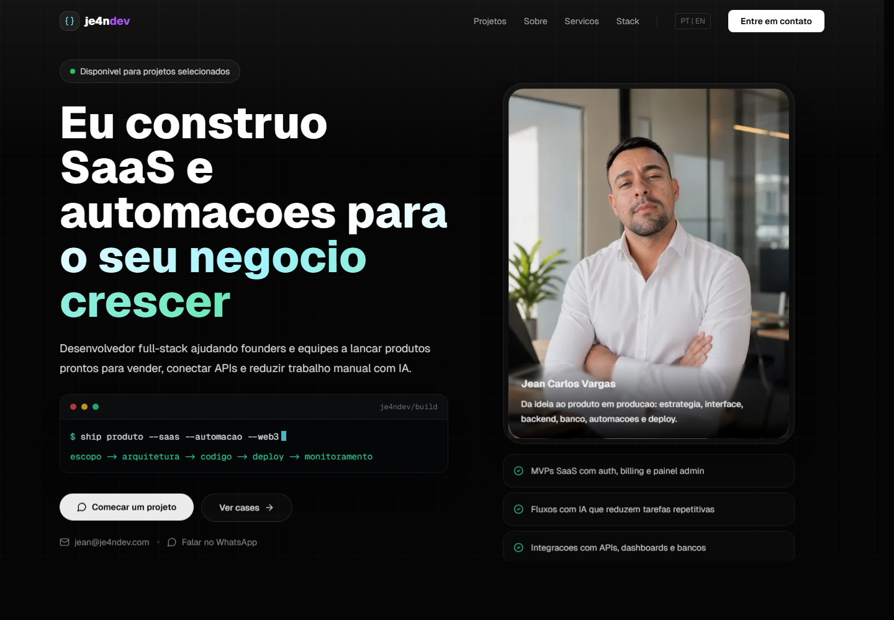
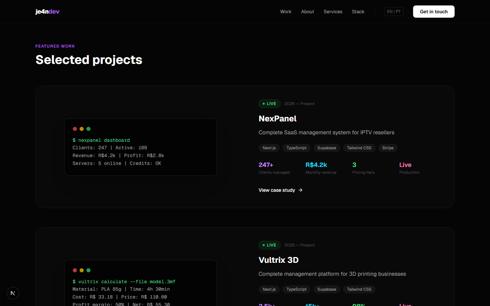
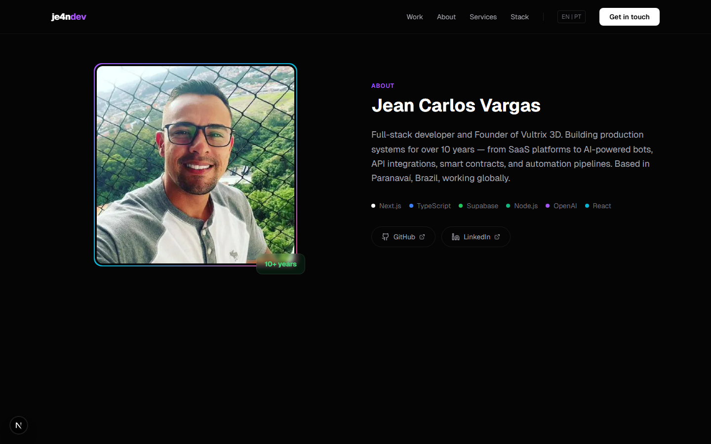
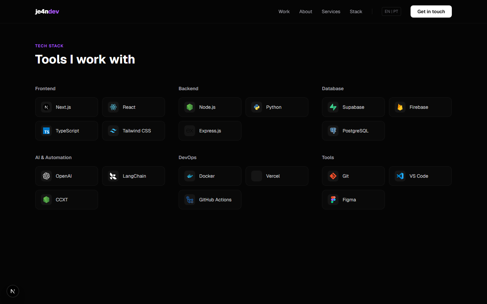
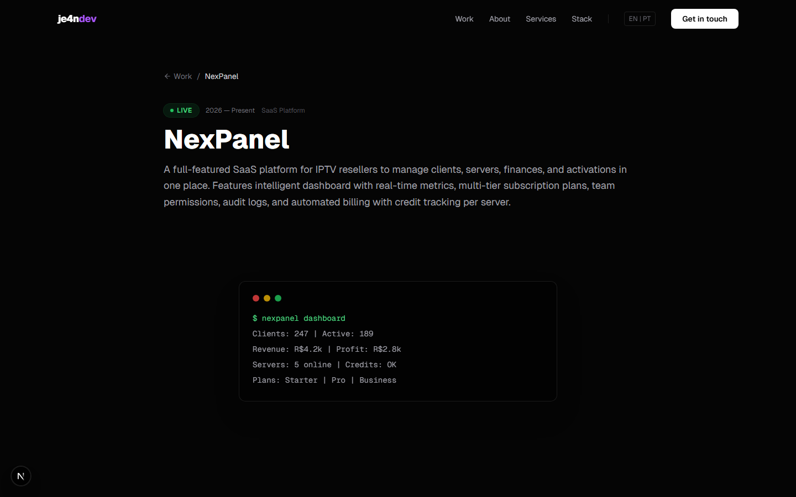
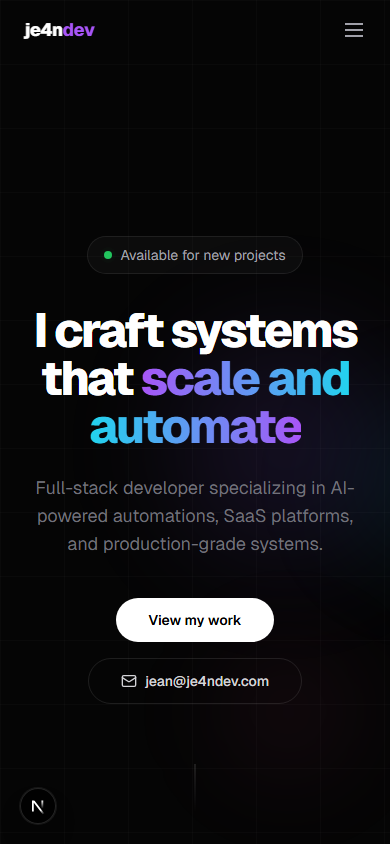

<div align="center">



<br />
<br />

# je4ndev.com

**Personal portfolio of Jean Carlos Vargas**
**Full-Stack Engineer · SaaS, Internal Tools & AI Automation**

[](https://je4ndev.com)
[](https://nextjs.org)
[](https://typescriptlang.org)
[](https://tailwindcss.com)
[](https://vercel.com)

Dark minimal portfolio with bold gradient accents, bilingual support (EN/PT-BR),
project case studies, and smooth Framer Motion animations.

[**View Live**](https://je4ndev.com) &middot; [**Projects**](#-featured-projects) &middot; [**Tech Stack**](#-tech-stack) &middot; [**Getting Started**](#-getting-started)

</div>

---

## Preview

<table>
<tr>
<td width="50%">

**Featured Work**



</td>
<td width="50%">

**About**



</td>
</tr>
<tr>
<td width="50%">

**Tech Stack — Real SVG icons**



</td>
<td width="50%">

**Case Study Page**



</td>
</tr>
</table>

<details>
<summary><strong>Mobile View</strong></summary>
<br />
<div align="center">

</div>
</details>

---

## Highlights

- **Bilingual** — EN/PT-BR toggle, client-side, no page reload
- **Case Studies** — Each project has its own page with problem/solution breakdown, stack, and context
- **Visual Effects** — Animated grid, floating gradient orbs, 3D tilt cards, magnetic buttons, scroll reveals
- **Performance** — Static generation (SSG), ~160 kB First Load JS, Lighthouse 90+ target
- **Accessibility** — Reduced motion support, semantic HTML, ARIA labels, keyboard navigation
- **Responsive** — Mobile-first design, tested on 390px to 1440px+

---

## Featured Projects

| Project | What it does | Stack | Status |
|---------|-------------|-------|--------|
| [**NexPanel**](https://nexpanel.je4ndev.com) | B2B management platform for IPTV operations and billing flows | Next.js, Supabase, Stripe | **Case study** |
| [**Vultrix 3D**](https://www.vultrix3d.com.br) | Pricing and operations system for a 3D printing business | Next.js, Supabase, Tailwind | **Live business** |
| [**OpenClaw Gateway**](https://github.com/JE4NVRG/openclaw-gateway) | Multi-platform automation hub for AI-driven workflows | Node.js, OpenAI, Supabase | **Internal** |
| [**HypeFC**](https://hypefc.je4ndev.com) | Real-time football dashboard with live data and standings | Next.js, API Football | **Public demo** |
| [**MepChat**](https://github.com/JE4NVRG/mepchat) | WhatsApp chatbot + admin dashboard for business workflows | Node.js, Firebase, OpenAI | **MVP** |

---

## Tech Stack

| Layer | Technologies |
|-------|-------------|
| **Framework** | Next.js 16 (App Router, SSG, Server Components) |
| **Language** | TypeScript (strict mode) |
| **Styling** | Tailwind CSS 4, CSS custom properties |
| **Animations** | Framer Motion (orbs, tilt, magnetic, scroll reveal) |
| **Icons** | Lucide React, Devicon SVGs, SimpleIcons |
| **i18n** | React Context + localStorage persistence |
| **Deploy** | Vercel (auto-deploy from GitHub) |

---

## Architecture

```
src/
├── app/
│   ├── layout.tsx                 # Root layout — fonts, providers, navbar, footer
│   ├── page.tsx                   # Home — composes 6 sections
│   └── projects/[slug]/page.tsx   # Case study pages (SSG via generateStaticParams)
├── components/
│   ├── layout/                    # Navbar (sticky, blur), Footer
│   ├── sections/                  # Hero, FeaturedWork, About, TechStack, Services, Contact
│   ├── projects/                  # CaseStudy component
│   └── ui/                        # AnimatedGrid, GradientOrbs, MagneticButton, TiltCard, SectionReveal
├── data/
│   └── projects.ts                # Project definitions (bilingual, typed)
├── i18n/
│   ├── translations/              # en.ts, pt.ts — all UI strings
│   ├── provider.tsx               # LanguageProvider (React Context)
│   └── use-translation.ts         # useTranslation() hook
├── lib/
│   └── utils.ts                   # cn() — clsx + tailwind-merge
└── types/
    └── project.ts                 # Project interface
```

**Design decisions:**
- Server Components for static pages, Client Components only where interactivity is needed
- Project data defined in TypeScript — no CMS, no database, no API calls
- i18n via React Context — instant toggle, persisted in localStorage
- All pages statically generated at build time

---

## Getting Started

```bash
git clone https://github.com/JE4NVRG/jeanvargas.dev.git
cd jeanvargas.dev
npm install
npm run dev
```

Open [localhost:3000](http://localhost:3000). No environment variables required.

| Command | Description |
|---------|------------|
| `npm run dev` | Development server (Turbopack) |
| `npm run build` | Production build |
| `npm start` | Production server |
| `npm run lint` | ESLint check |

---

## Performance

| Metric | Value |
|--------|-------|
| First Load JS | ~160 kB |
| Pages | All statically generated (SSG) |
| Lighthouse Performance | 90+ target |
| Reduced Motion | Respects `prefers-reduced-motion` |
| Images | `next/image` with lazy loading |
| Fonts | Geist Sans + Geist Mono (preloaded) |

---

## Contact

<div align="center">

**Jean Carlos Vargas**
Full-Stack Engineer · SaaS, Internal Tools & AI Automation
Paranavaí, Brazil

[](https://je4ndev.com)
[](mailto:jean@je4ndev.com)
[](https://github.com/JE4NVRG)
[](https://www.linkedin.com/in/je4ndev/)
[](https://wa.me/5511914826568)

</div>

---

<div align="center">

MIT License

Built with Next.js, TypeScript, and Framer Motion.

</div>
