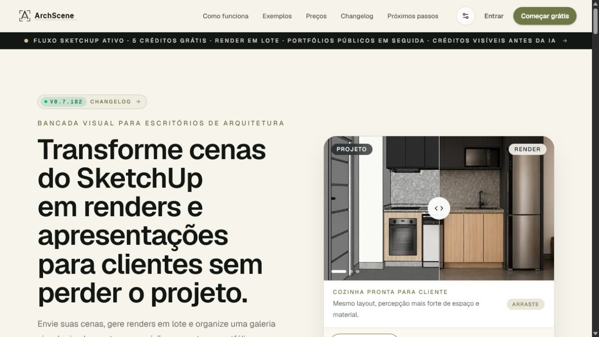
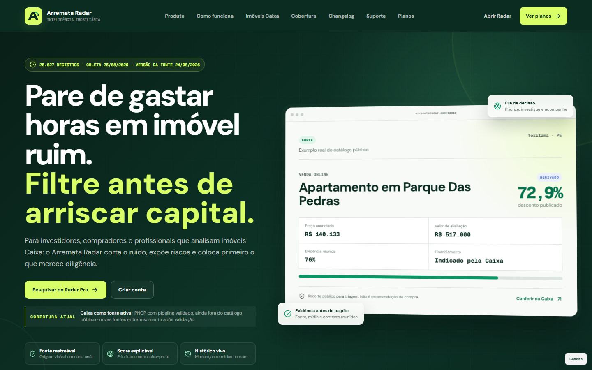
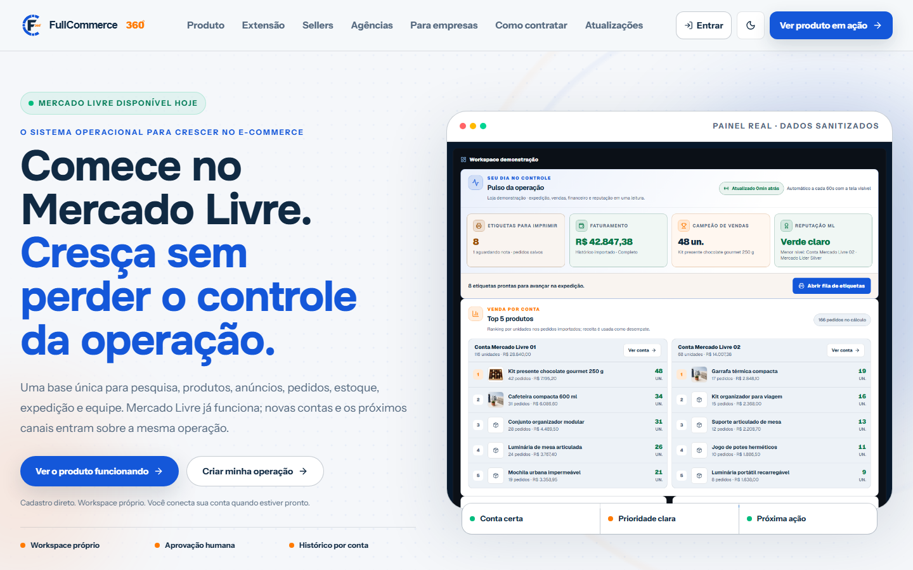

<!-- markdownlint-disable MD013 MD033 MD036 MD041 -->

<div align="center">


# JE4NDEV

**Jean Carlos Vargas** · desenvolvimento de SaaS, sistemas e automações com IA

[](https://je4ndev.com/pt)
[](https://nextjs.org)
[](https://www.typescriptlang.org)
[](LICENSE)

Portfólio bilíngue (PT/EN) com cases reais, prova visual revisada e oferta founder-led.

[Site](https://je4ndev.com/pt) · [Serviços](https://je4ndev.com/pt#services) · [WhatsApp](https://wa.me/5511948477047)


</div>

## O que o site precisa deixar claro

1. O que a JE4NDEV constrói.
2. Quais produtos já existem, com URL e evidência.
3. O que é produto ao vivo, demo, case ou ferramenta interna.
4. Como começar um recorte com escopo, preview e revisão direta.

Catálogo atual: **14 cases**, **8 produtos públicos**, **3 flagships**.

## Flagships

<table>
<tr>
<td width="33%" valign="top">

**[ArchScene](https://archscene.com)**

Renders arquitetônicos com IA.



</td>
<td width="33%" valign="top">

**[Arremata Radar](https://arremataradar.com)**

Inteligência para imóveis da Caixa.



</td>
<td width="33%" valign="top">

**[FullCommerce360](https://fullcommerce360.com)**

Operação do seller no Mercado Livre.



</td>
</tr>
</table>

## Produtos públicos

| Produto | Entrega | Prova |
| --- | --- | --- |
| [ArchScene](https://archscene.com) | Plataforma de renders arquitetônicos com IA | Produto público |
| [Arremata Radar](https://arremataradar.com) | Inteligência para imóveis da Caixa | Landing pública + captura |
| [FullCommerce360](https://fullcommerce360.com) | Sistema operacional do seller no Mercado Livre | Landing pública + captura |
| [NexPanel](https://nexpanel.agenciamep.com) | SaaS multi-tenant para revenda | Dashboard sanitizado |
| [Vultrix 3D](https://www.vultrix3d.com.br) | Custos, precificação, estoque e financeiro | Dashboard sanitizado |
| [Stop Ultimate](https://stopultimate.vercel.app) | Jogo multiplayer com juiz de IA | Jogo público |
| [Alchemix Auditor](https://alchemix-auditor.vercel.app) | Checklist público de auditoria Web3 | Interface pública; não substitui auditoria independente |
| [Ethena Scanner](https://ethena-scanner.vercel.app) | Scanner de segurança em demonstração | Fluxo público; não comprova segurança independente |

URLPivot está no catálogo como **demo** (landing dogfood, sem cadastro público). Hermes Agentes e OpenClaw Gateway aparecem com limite explícito de prova.

## Capturas do portfólio

<table>
<tr>
<td width="68%" valign="top">

**Arquivo de projetos**


</td>
<td width="32%" valign="top">

**Mobile · 390 px**


</td>
</tr>
</table>

## Oferta

- [Desenvolvimento de SaaS sob medida](https://je4ndev.com/pt/services/desenvolvimento-saas)
- [Automações com IA e integrações](https://je4ndev.com/pt/services/automacoes-ia)
- [Agentes de IA privados](https://je4ndev.com/pt/services/agentes-ia-privados)

## Recursos

- Homes e cases indexáveis em `/pt` e `/en`
- Páginas de serviço, termos e privacidade
- Catálogo pesquisável, com nível de prova por case
- CTAs para produto, GitHub, demo ou WhatsApp
- SEO: canonical, hreflang, Open Graph, JSON-LD, sitemap
- Analytics first-party sem cookie, schema fechado
- Vídeo do hero só no desktop, depois do first paint
- Headers `nosniff`, `DENY` e Permissions-Policy

## Stack

| Camada | Tecnologias |
| --- | --- |
| Frontend | Next.js 16, React 19, TypeScript, Tailwind CSS |
| Motion | Framer Motion, GSAP, Lenis |
| Conteúdo | TypeScript + Zod |
| Imagens | `next/image`, WebP e capturas versionadas |
| SEO | Metadata API, JSON-LD, sitemap, robots, SSG |
| Qualidade | ESLint, TypeScript strict, `npm run gate` local ou VPS |
| Deploy | VPS `jeanvargas-dev` + `scripts/deploy-vps.sh` |

## Arquitetura

```text
src/
├── app/[locale]/
│   ├── page.tsx
│   ├── projects/[slug]/
│   ├── services/[slug]/
│   ├── termos/
│   └── privacidade/
├── components/
│   ├── brand/
│   ├── legal/
│   ├── layout/
│   ├── projects/
│   └── sections/
├── data/
│   ├── company.ts
│   ├── flagships.ts
│   ├── legal.ts
│   ├── projects.ts
│   └── services.ts
└── i18n/
```

O catálogo em `src/data/projects.ts` é a fonte de verdade. `npm run audit:projects` bloqueia prioridade duplicada, asset ausente e prova inconsistente.

## Execução local

```bash
git clone https://github.com/JE4NVRG/jeanvargas.dev.git
cd jeanvargas.dev
npm ci
npm run dev
```

Abra [http://localhost:3000/pt](http://localhost:3000/pt).

## Comandos

| Comando | Objetivo |
| --- | --- |
| `npm run dev` | Servidor local com Turbopack |
| `npm run lint` | ESLint |
| `npm run typecheck` | Tipos de rotas + TypeScript |
| `npm run audit:projects` | Integridade do catálogo e dos assets |
| `npm run audit:links` | Links públicos dos projetos |
| `npm run test:analytics` | Atribuição, schema, privacidade e relatório |
| `npm run build` | Build de produção |
| `npm run gate` | Gate local/VPS: lint, types, analytics, catálogo |
| `npm run ci:local` | Alias do gate, sem GitHub Actions |
| `npm run validate` | Gate + links de campanha + build |
| `scripts/deploy-vps.sh` | Pull, gate, build e restart na Luna |

## Qualidade

Não usamos GitHub Actions. O gate é gratuito e roda na máquina local ou na VPS:

```bash
npm ci
npm run gate
```

Antes de publicar na Luna:

```bash
ssh luna-vps 'bash /home/jean/jeanvargas.dev/scripts/deploy-vps.sh'
```

Nenhuma chave, cookie ou `.env` deve ser versionado.

## Contato

- Site: [je4ndev.com](https://je4ndev.com/pt)
- E-mail: [jean@je4ndev.com](mailto:jean@je4ndev.com)
- GitHub: [@JE4NVRG](https://github.com/JE4NVRG)
- LinkedIn: [in/je4ndev](https://www.linkedin.com/in/je4ndev/)
- WhatsApp: [iniciar conversa](https://wa.me/5511948477047)
- [Termos](https://je4ndev.com/pt/termos) · [Privacidade](https://je4ndev.com/pt/privacidade)

## Licença

[MIT](LICENSE)

---

<div align="center">

Criado por **Jean Carlos Vargas / JE4NDEV**

</div>
