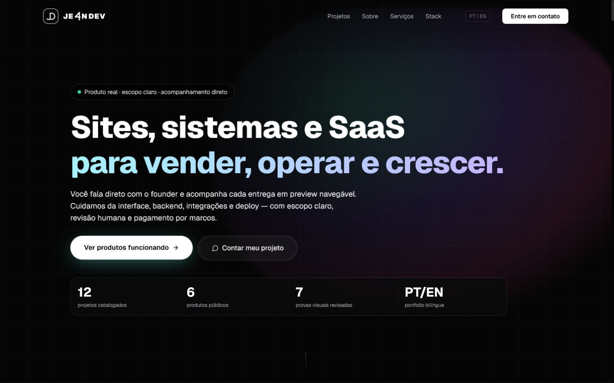
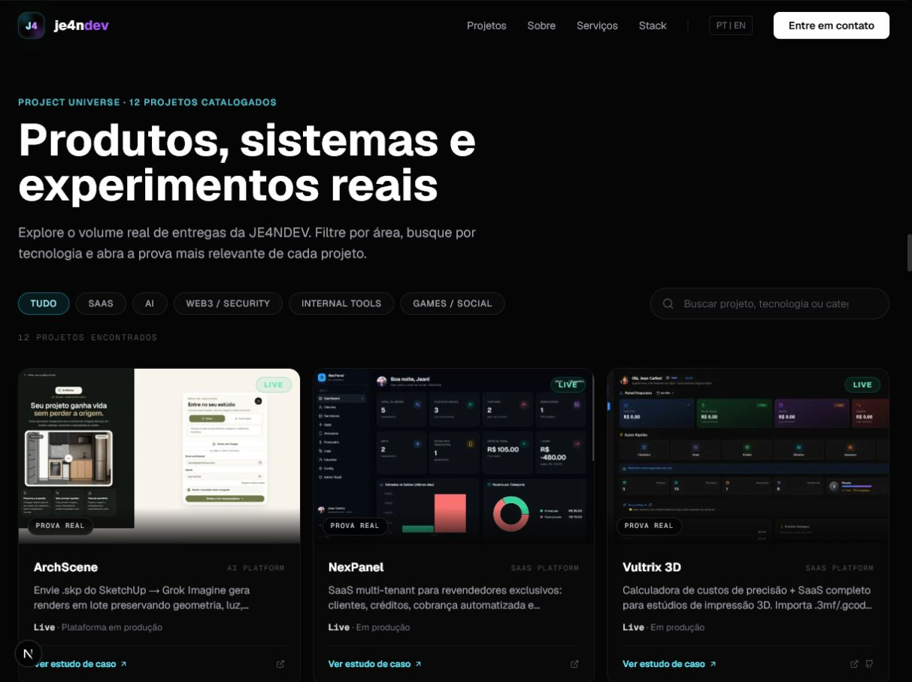
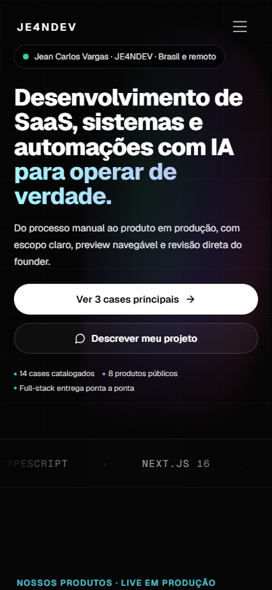

<!-- markdownlint-disable MD013 MD033 MD036 MD041 -->

<div align="center">



# JE4NDEV Portfolio

**Sites, sistemas e SaaS para vender, operar e crescer.**

[](https://je4ndev.com)
[](https://nextjs.org)
[](https://react.dev)
[](https://www.typescriptlang.org)
[](LICENSE)

Portfólio bilíngue e orientado a conversão de **Jean Carlos Vargas / JE4NDEV**.
Apresenta produtos reais, estudos de caso, provas visuais revisadas e o processo de entrega founder-led.

[Ver portfólio](https://je4ndev.com) · [Explorar projetos](https://je4ndev.com/pt#universe) · [Falar sobre um projeto](https://wa.me/5511948477047)

</div>

## Visão geral

O projeto foi construído para responder quatro perguntas de um potencial cliente:

1. O que a JE4NDEV entrega?
2. Quais produtos já foram construídos?
3. Qual é a evidência disponível para cada case?
4. Como iniciar uma conversa com escopo e expectativas claras?

O catálogo atual reúne **12 projetos**, com **6 produtos públicos** e **7 provas visuais revisadas**. Cada projeto declara seu nível de prova para diferenciar produto público, demonstração privada, case editorial e ferramenta interna.

## Produtos com acesso público

| Produto | Entrega | Evidência principal |
| --- | --- | --- |
| [ArchScene](https://archscene.com) | Plataforma de renders arquitetônicos com IA | Produto público + case visual |
| [NexPanel](https://nexpanel.agenciamep.com) | SaaS multi-tenant para operações de revenda | Produto público + dashboard revisado |
| [Vultrix 3D](https://www.vultrix3d.com.br) | Custos, precificação, estoque e financeiro | Produto público + dashboard revisado |
| [Stop Ultimate](https://stopultimate.vercel.app) | Jogo multiplayer com juiz de IA | Jogo público + interface atual |
| [Alchemix Auditor](https://alchemix-auditor.vercel.app) | Checklist público de auditoria Web3 | Interface pública; não substitui auditoria independente |
| [Ethena Scanner](https://ethena-scanner.vercel.app) | Demonstração de scanner de segurança | Fluxo público; não comprova segurança independente |

Cases com operação ou prova parcialmente privada — como Gestão ML, Hermes Agentes e OpenClaw Gateway — são apresentados com esse limite explícito no site.

## Capturas atuais

<table>
<tr>
<td width="68%" valign="top">

**Universo de projetos**



</td>
<td width="32%" valign="top">

**Mobile — 390 px**



</td>
</tr>
</table>

## Principais recursos

- Rotas localizadas e indexáveis em `/pt` e `/en`.
- 24 páginas estáticas de projetos, além das duas homes localizadas.
- Catálogo pesquisável por produto, tecnologia e categoria.
- Estudos de caso com problema, entrega, resultado, stack e prova visual.
- CTAs contextuais para produto público, código, demonstração ou contato.
- Analytics first-party para page view, conversão, profundidade de leitura e engajamento.
- SEO técnico com canonical, `hreflang`, Open Graph, Twitter cards, JSON-LD, sitemap e robots.
- Animações com fallback para `prefers-reduced-motion`, Save-Data e conexões lentas.
- Headers básicos de segurança e endpoint de captura desativado em produção.

## Stack

| Camada | Tecnologias |
| --- | --- |
| Frontend | Next.js 16, React 19, TypeScript, Tailwind CSS |
| Motion | Framer Motion, GSAP, Lenis |
| Conteúdo | Dados tipados em TypeScript + validação com Zod |
| Imagens | `next/image`, WebP e assets versionados por projeto |
| SEO | Metadata API, JSON-LD, sitemap, robots e páginas SSG |
| Qualidade | ESLint, TypeScript strict, auditor de projetos e GitHub Actions |
| Deploy | Build `standalone`, preparado para VPS ou plataforma compatível com Next.js |

## Arquitetura

```text
src/
├── app/
│   ├── [locale]/
│   │   ├── page.tsx
│   │   └── projects/[slug]/page.tsx
│   ├── api/
│   │   ├── analytics/route.ts
│   │   ├── health/route.ts
│   │   └── save-screenshot/route.ts
│   ├── robots.ts
│   └── sitemap.ts
├── components/
│   ├── analytics/
│   ├── layout/
│   ├── projects/
│   ├── sections/
│   └── ui/
├── data/
│   ├── project-schema.ts
│   └── projects.ts
├── i18n/
├── types/
└── proxy.ts

public/projects/
├── captures/
├── covers/
└── gallery/
```

O catálogo é a fonte de verdade. Cada entrada possui status, nível de prova, CTAs, métricas verificáveis, tecnologias e revisão de assets. O script `audit:projects` impede prioridades duplicadas, arquivos ausentes e provas inconsistentes.

## Execução local

Requisitos recomendados:

- Node.js 22
- npm 10+

```bash
git clone https://github.com/JE4NVRG/jeanvargas.dev.git
cd jeanvargas.dev
npm ci
npm run dev
```

Acesse [http://localhost:3000/pt](http://localhost:3000/pt).

## Comandos

| Comando | Objetivo |
| --- | --- |
| `npm run dev` | Servidor local com Turbopack |
| `npm run lint` | Validação ESLint |
| `npm run typecheck` | Tipos de rotas + TypeScript |
| `npm run audit:projects` | Integridade do catálogo e dos assets |
| `npm run audit:links` | Verificação dos links públicos dos projetos |
| `npm run build` | Build otimizado de produção |
| `npm run validate` | Gate completo: lint, tipos, catálogo e build |

## Qualidade e segurança

O workflow `.github/workflows/portfolio-quality.yml` executa em pull requests:

```bash
npm ci
npm run validate
npm audit --omit=dev --audit-level=high
```

Controles adicionais:

- payloads de analytics validados com Zod e limitados a 4 KB;
- upload de screenshots limitado a imagens JPEG/PNG de até 8 MB e desativado em produção;
- filenames e subdiretórios validados antes de qualquer escrita local;
- headers `nosniff`, `DENY`, política de referência e bloqueio de câmera/microfone/localização;
- nenhuma chave, cookie ou arquivo `.env` deve ser versionado.

## Analytics e privacidade

O portfólio utiliza um endpoint first-party sem cookies para registrar eventos essenciais. Hoje os eventos são emitidos como logs estruturados do servidor; persistência, dashboard e retenção devem ser definidos na infraestrutura antes de campanhas pagas.

## Documentação

- [Design e critérios visuais](DESIGN.md)
- [Auditoria geral — performance, SEO, segurança e GitHub](docs/AUDIT-GERAL-PORTFOLIO-2026-07-18.md)
- [Auditoria de captação de clientes](docs/AUDIT-CAPTACAO-CLIENTES-2026-07-17.md)
- [Especificação do sistema de apresentação](docs/specs/2026-06-03-project-presentation-system.md)
- [Plano de captura de assets](docs/specs/2026-06-03-project-asset-capture-plan.md)
- [Backlog de entrada de novos projetos](docs/specs/2026-07-17-project-intake-backlog.md)

## Contato

- Portfólio: [je4ndev.com](https://je4ndev.com)
- E-mail: [jean@je4ndev.com](mailto:jean@je4ndev.com)
- GitHub: [@JE4NVRG](https://github.com/JE4NVRG)
- LinkedIn: [linkedin.com/in/je4ndev](https://www.linkedin.com/in/je4ndev/)
- WhatsApp: [iniciar conversa](https://wa.me/5511948477047)

## Licença

Distribuído sob a [licença MIT](LICENSE).

---

<div align="center">

Construído e mantido por **Jean Carlos Vargas — JE4NDEV**.

</div>
