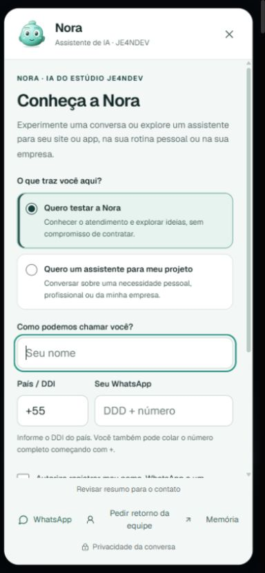
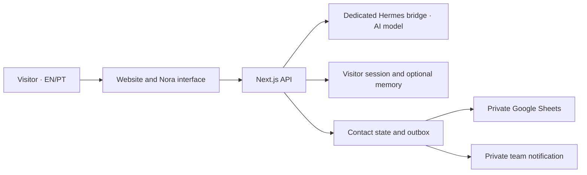

<!-- markdownlint-disable MD013 MD033 MD041 -->

**English** · [Português (Brasil)](README.pt-BR.md)

<div align="center">

<picture>
  <source media="(prefers-color-scheme: dark)" srcset="docs/screenshots/readme/brand-white.svg" />
  <source media="(prefers-color-scheme: light)" srcset="docs/screenshots/readme/brand-black.svg" />
  
</picture>

# From your idea to a working product.

**Websites, custom software and AI assistants for individuals and businesses.**

JE4NDEV is Jean Carlos Vargas's digital product agency, based in Brazil and working remotely in English and Portuguese. We help you present your work, simplify a process or turn your expertise into a product you can use and improve.

[](https://je4ndev.com/en) [](https://nextjs.org) [](https://www.typescriptlang.org) [](LICENSE)

[Visit the English website](https://je4ndev.com/en) · [Explore our products](#products) · [Meet Nora](#nora) · [Discuss your project](mailto:jean@je4ndev.com)


</div>

## What we can build together

You do not need a complete specification to start. Bring the idea, the task that takes too much work, or the problem your current tools do not solve. We define a first scope with something you can open, test or review before deciding what comes next.

- **A website that explains your offer.** A portfolio, business website or landing page that helps people understand what you do and how to reach you.
- **Software that fits how you work.** A custom internal system, connected tools or a SaaS product built around your expertise and the people who will use it.
- **An AI assistant for your own needs.** Support for personal tasks, study, research or business operations, with context, integrations and permissions defined for the job.
- **A clearer workflow.** Automations and integrations that connect existing tools and handle the exceptions your process needs.

This repository powers the JE4NDEV website and its **Nora** assistant. The site includes English and Portuguese content, responsive layouts, reduced-motion alternatives, service pages and project case studies. Each case explains the work, available evidence and relevant limitations.

## Products

These four featured projects show different kinds of work. Public pages and labelled demonstrations let you inspect the product; they are not claims about customer numbers, revenue or guaranteed results.

| Product | What you can explore | Links |
| --- | --- | --- |
| **MepMail** | Transactional email for applications and AI agents, with API, SMTP and MCP integration on Amazon SES. Maintained and operated on an attributed open-source foundation. | [Case study](https://je4ndev.com/en/projects/mepmail) · [Product](https://mepmail.je4ndev.com) |
| **ArchScene** | An AI-assisted architectural rendering workflow with project organization and batch scene processing. | [Case study](https://je4ndev.com/en/projects/archscene) · [Product](https://archscene.com) |
| **FullCommerce360** | Marketplace operations, product organization and connected accounts. Its presentation includes labelled demonstrations. | [Case study](https://je4ndev.com/en/projects/fullcommerce360) · [Product](https://fullcommerce360.com) |
| **URLPivot** | Managed links with editable destinations, reusable QR codes and campaign Pages, with MCP integration for agents. | [Case study](https://je4ndev.com/en/projects/urlpivot) · [Product](https://urlpivot.app) |

**MepMail attribution:** JE4NDEV adapts, maintains and operates the product; its open-source foundation retains its **AGPL** licence and attribution. This does not claim authorship of the original upstream code. [MepMail source](https://github.com/JE4NVRG/mepmail).

[Explore the projects on the website →](https://je4ndev.com/en#work)

## Nora

**A working AI assistant on the JE4NDEV website, and an example of what we can build for your website, app or everyday work.**

Try Nora to explore an idea or see how an assistant could help you. She discusses websites, software, integrations and personalized assistants, using the goals, existing tools and constraints you share. Trying the assistant is separate from requesting a proposal.

### From a conversation to a useful next step

1. **Choose why you are here.** Try Nora or explore an assistant for a personal, professional or business project. Enter your name and WhatsApp number with a country code, then authorize registration. Registration does not enable marketing or optional memory.
2. **Explain what you need.** Nora organizes your goal, current situation, desired solution, constraints and unanswered questions. She can suggest a first scope and questions for human review.
3. **Review before requesting contact.** You can review the summary and ask the team to reply. Nora does not confirm a contract, price, deadline or work the team has not performed.
4. **Keep the handoff organized.** The integration updates the same contact record in the team's private Google Sheets. The summary, proposed scope and next steps stay with the contact; the team controls the manual status and assignee fields.
5. **Choose whether to keep project memory.** Optional memory lets you review, edit and delete saved facts. Cross-browser recovery requires the registered number **and a personal recovery code**. The number alone cannot retrieve memory.


*An actual validation conversation using a fictional scenario. No customer contacts or customer data appear in the capture. The English interface is available on the live website; the conversation and mobile captures show the Portuguese interface.*

### Desktop, mobile and the first conversation

<table>
  <tr>
    <td width="50%" valign="top">
      <strong>Mobile website</strong><br /><br />
      
    </td>
    <td width="50%" valign="top">
      <strong>Meeting Nora</strong><br /><br />
      
    </td>
  </tr>
</table>

### Memory, privacy and practical limits

- Project memory is **optional**, separate from the contact registration. It supports up to five projects and expires 30 days after the last update.
- You can edit or delete saved memory. Deleting memory does not erase the separately authorized contact record. Number-and-code recovery does not verify ownership of a WhatsApp number, and it does not restore the full chat transcript.
- The browser receives neither provider credentials nor access to the operator's tools and files. Model access runs through an authenticated server bridge.
- Public endpoints use Turnstile, CSRF and origin/ingress validation, with request and concurrency limits. These are abuse controls, not a guaranteed financial cap or a claim that every malicious prompt can be detected.
- Contact synchronization has its own retry queue and preserves the team's manual fields. Private Telegram notifications are a separate integration; a saved or synchronized record does not mean a human has read or answered it. Nora does not send WhatsApp messages automatically.
- Visiting the website does not use an inference slot. If the assistant is busy, your text is kept for a manual retry. The current chat has limited concurrent capacity and no automatic conversation queue.

AI processing and data retention are described in the [privacy policy](https://je4ndev.com/en/privacidade). Registration, optional memory and a request for contact serve different purposes.

[Try Nora on the English website →](https://je4ndev.com/en) · [Nora case study](https://je4ndev.com/en/projects/nora)

## Discuss your project

Tell us what you want to build or make easier. A personal project, an independent practice and a business operation can all be starting points. We work remotely in English and Portuguese; scope and investment are agreed before the build.

[Email Jean](mailto:jean@je4ndev.com) · [WhatsApp](https://wa.me/5511914826568) · [English website](https://je4ndev.com/en) · [GitHub @JE4NVRG](https://github.com/JE4NVRG) · [LinkedIn](https://www.linkedin.com/in/je4ndev/)

## For developers

<details>
<summary>Architecture, local development and delivery</summary>

### Architecture


```mermaid
flowchart LR
  Visitor["Visitor · EN/PT"] --> Site["Website and Nora interface"]
  Site --> API["Next.js API"]
  API --> Model["Dedicated Hermes bridge · AI model"]
  API --> Memory["Visitor session and optional memory"]
  API --> Contacts["Contact state and outbox"]
  Contacts --> Sheets["Private Google Sheets"]
  Contacts --> Team["Private team notification"]
```

| Layer | Implementation |
| --- | --- |
| Interface | Next.js 16.3, React 19, TypeScript and Tailwind CSS |
| Motion | Framer Motion, GSAP, Lenis and media playback controls |
| Content | Typed data, Zod, English/Portuguese translations and case pages |
| Discovery | Metadata API, canonical, hreflang, Open Graph, JSON-LD, sitemap and crawling rules |
| Nora | Server API, authenticated Hermes bridge, structured briefing and optional memory |
| Contacts | Server persistence, signed Apps Script/Sheets synchronization and notifications |
| Quality | ESLint, strict TypeScript, tests and local audits |
| Production | Next.js standalone runtime built locally and promoted to the VPS |

```text
src/app/                 Localized pages and conversation, visitor and contact APIs
src/components/          Brand, layout, projects, motion and Nora interface
src/data/                Company, services, catalogue, presentations and SEO content
src/i18n/                English/Portuguese translations and navigation
src/lib/concierge/       Validation, quotas, context, sessions and memory
src/lib/leads/           Contact records, synchronization and retention
integrations/nora-sheets/ Authenticated Google Sheets relay
scripts/                 Audits and operational jobs
docs/                    Documentation and captures
```

### Local development

Requires **Node.js 20.9 or later** and npm. Reuse the existing checkout and environment. If dependencies are not installed, run `npm ci`, then start development:

```bash
npm run dev
```

Open [localhost:3000/en](http://localhost:3000/en) or [localhost:3000/pt](http://localhost:3000/pt).

Use [.env.example](.env.example) as the integration configuration reference. Keep real values in a Git-ignored local file or private server configuration. Nora requires a session, trusted ingress and a configured AI bridge; installing the frontend does not provision a model or a spreadsheet.

| Command | Purpose |
| --- | --- |
| `npm run dev` | Local development with Turbopack |
| `npm run lint` | ESLint checks |
| `npm run typecheck` | Route types and TypeScript checks |
| `npm test` | Analytics, conversation, memory, contact and content tests |
| `npm run audit:projects` | Catalogue and asset integrity |
| `npm run audit:seo` | Metadata and discovery-content audit |
| `npm run audit:links` | Public project-link checks |
| `npm run gate` | Lint, types, tests and project audit |
| `npm run validate` | Gate, campaign-link validation and build |
| `npm run build` | Production artifact build |
| `npm run sync:leads` | Contact synchronization to Sheets, when configured |
| `npm run notify:leads` | Contact-notification job, when configured |

### Delivery

Development, tests and builds run locally. Publication promotes a minimal artifact, verifies the served revision and affected journey, and preserves a valid rollback. The recorded 2026-10-01 production validation included **291 passing tests**, a local Linux build, runtime smoke checks and browser journeys. Those release checks are not a load benchmark.

`scripts/deploy-vps.sh` is a historical remote-build script, not the current delivery workflow. Keys, cookies, environment values, contacts, recovery codes and runtime state stay out of the repository and documentation captures.

</details>

## License

This portfolio's code is available under the [MIT license](LICENSE). Products and open-source foundations referenced in the case studies retain their own licences and attribution, including MepMail's AGPL foundation.
