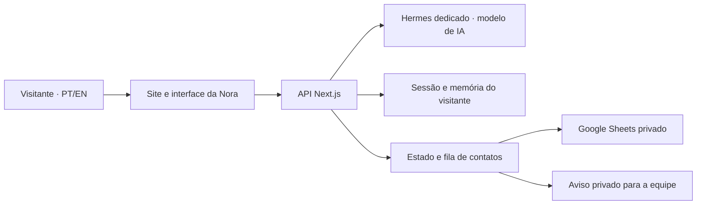

<!-- markdownlint-disable MD013 MD033 MD041 -->

[English](README.md) · **Português (Brasil)**

<div align="center">

<picture>
  <source media="(prefers-color-scheme: dark)" srcset="docs/screenshots/readme/brand-white.svg" />
  <source media="(prefers-color-scheme: light)" srcset="docs/screenshots/readme/brand-black.svg" />
  
</picture>

# Da sua ideia a um produto real.

**Sites, sistemas e assistentes de IA para pessoas físicas e jurídicas.**

Portfólio e site do estúdio JE4NDEV, criado por Jean Carlos Vargas. Uma apresentação dos produtos que construímos e uma experiência real de atendimento com a **Nora**.

[](https://je4ndev.com/pt) [](https://nextjs.org) [](https://www.typescriptlang.org) [](LICENSE)

[Site em português](https://je4ndev.com/pt) · [English website](https://je4ndev.com/en) · [Nora](#nora) · [Produtos](#produtos) · [Desenvolvimento](#desenvolvimento)


</div>

## O projeto

A JE4NDEV transforma ideias e problemas da rotina em produtos digitais: uma presença profissional na internet, um sistema sob medida, uma integração entre ferramentas ou um assistente de IA personalizado.

O site combina identidade própria, movimento, projetos com contexto e contato direto com quem conduz o trabalho. A Nora participa dessa experiência: ajuda o visitante a explicar o que precisa e organiza as informações para uma conversa com a equipe.

- Experiência responsiva em **português e inglês**.
- Projetos apresentados com problema, entrega, tecnologias e links disponíveis.
- Páginas de serviço e cases com conteúdo indexável.
- Vídeo, animações e alternativas para quem prefere movimento reduzido.
- GitHub acessível no cabeçalho, na seção Sobre e no rodapé.
- Atendimento para pessoas físicas, profissionais autônomos e empresas.

## Produtos

Os quatro destaques atuais representam diferentes tipos de entrega. Os cases informam o nível de prova disponível, incluindo demonstrações e dados fictícios quando utilizados.

| Produto | O que apresenta | Conhecer |
| --- | --- | --- |
| **MepMail** | E-mail transacional integrado a aplicações e agentes, com API, SMTP e MCP sobre Amazon SES. Adaptação e operação sobre uma base open source atribuída. | [Case](https://je4ndev.com/pt/projects/mepmail) · [Produto](https://mepmail.je4ndev.com) |
| **ArchScene** | Fluxo de renders arquitetônicos com IA, organização por projeto e processamento de cenas em lote. | [Case](https://je4ndev.com/pt/projects/archscene) · [Produto](https://archscene.com) |
| **FullCommerce360** | Organização da operação de marketplace, produtos e contas conectadas. A apresentação inclui demonstrações identificadas. | [Case](https://je4ndev.com/pt/projects/fullcommerce360) · [Produto](https://fullcommerce360.com) |
| **URLPivot** | Links com destino editável, QR Codes reutilizáveis e Pages, com integração para agentes via MCP. | [Case](https://je4ndev.com/pt/projects/urlpivot) · [Produto](https://urlpivot.app) |

O MepMail é mantido e operado pela JE4NDEV sobre uma base open source cuja licença e atribuição **AGPL** são preservadas. Adaptação, manutenção e integrações não são uma alegação de autoria da base original. [Código do MepMail](https://github.com/JE4NVRG/mepmail).

[Explore os projetos no site →](https://je4ndev.com/pt#work)

## Nora

**Um assistente de IA em produção e um case do que podemos criar para seu site, aplicativo ou rotina.**

A Nora ajuda tanto quem chega com um projeto definido quanto quem ainda precisa descobrir o primeiro passo. Ela conversa sobre sites, sistemas, integrações e assistentes personalizados, considerando o objetivo, as ferramentas existentes e as restrições informadas.

### Da conversa ao atendimento

1. **Entrada com contexto.** O visitante escolhe entre experimentar a Nora ou conversar sobre um assistente para seu projeto. Informa nome e WhatsApp com DDI e autoriza o registro. Testar não equivale a pedir orçamento.
2. **Levantamento da necessidade.** A conversa organiza objetivo, situação atual, solução desejada, restrições e dúvidas pendentes. A Nora pode sugerir um primeiro escopo e perguntas para a avaliação humana.
3. **Resumo revisável.** O visitante pode revisar o texto e pedir retorno da equipe. A Nora não confirma contratação, preço, prazo ou ações que a equipe ainda não executou.
4. **Contato organizado.** A integração atualiza o mesmo registro em uma planilha privada do Google Sheets. Resumo, escopo e próximos passos acompanham o contato; status de atendimento e responsável permanecem sob controle da equipe.
5. **Continuidade opcional.** O visitante pode ativar memória de projetos, revisar fatos e apagá-los. A recuperação usa o número cadastrado **mais um código pessoal**; o telefone sozinho não abre a memória.


*Conversa real de validação com cenário fictício. A imagem não contém contatos ou dados de clientes.*

### Experiência em diferentes telas

<table>
  <tr>
    <td width="50%" valign="top">
      <strong>Site no celular</strong><br /><br />
      
    </td>
    <td width="50%" valign="top">
      <strong>Primeiro contato com a Nora</strong><br /><br />
      
    </td>
  </tr>
</table>

### Memória, privacidade e proteção

- A memória de fatos do visitante é **opcional**, separada do cadastro de atendimento, com até cinco projetos e expiração de 30 dias após a última atualização.
- O visitante pode editar a memória ou solicitar sua exclusão pela interface. O vínculo por número e código de recuperação não é uma verificação de titularidade do WhatsApp.
- O modelo é acessado por uma ponte autenticada no servidor. O navegador não recebe credenciais do provedor nem acesso às ferramentas e arquivos do operador.
- Turnstile, CSRF, validação de origem e ingresso confiável, limites de requisição e concorrência protegem os endpoints públicos.
- A fila de contatos mantém tentativas de sincronização com o Sheets e preserva campos manuais. Avisos privados no Telegram são uma integração separada; um registro sincronizado não significa atendimento humano concluído.
- A concorrência da IA tem seu próprio limite. Visitar o site não ocupa uma inferência; quando o chat está ocupado, o texto é preservado para uma nova tentativa manual. A versão atual não oferece fila automática de conversas.

O processamento de IA e a retenção de dados estão descritos na [política de privacidade](https://je4ndev.com/pt/privacidade). Cadastro, memória e pedido de contato têm finalidades distintas.

[Experimente a Nora no site →](https://je4ndev.com/pt) · [Case da Nora](https://je4ndev.com/pt/projects/nora)

## Arquitetura



| Camada | Implementação |
| --- | --- |
| Interface | Next.js 16.3, React 19, TypeScript e Tailwind CSS |
| Movimento | Framer Motion, GSAP, Lenis e mídia com controle de reprodução |
| Conteúdo | Dados tipados, Zod, traduções PT/EN e páginas de case |
| Descoberta | Metadata API, canonical, hreflang, Open Graph, JSON-LD, sitemap e regras de crawling |
| Nora | API no servidor, ponte autenticada para Hermes, briefing estruturado e memória opcional |
| Contatos | Persistência no servidor, sincronização assinada com Apps Script/Sheets e notificações |
| Qualidade | ESLint, TypeScript strict, testes e auditorias locais |
| Produção | Runtime Next.js standalone construído localmente e promovido na VPS |

```text
src/app/                 Páginas localizadas e APIs de conversa, visitantes e contatos
src/components/          Marca, layout, projetos, movimento e interface da Nora
src/data/                Empresa, serviços, catálogo, apresentações e conteúdo de SEO
src/i18n/                Traduções e navegação em português e inglês
src/lib/concierge/       Validação, quotas, contexto, sessões e memória
src/lib/leads/           Registros de contato, sincronização e retenção
integrations/nora-sheets/ Relay autenticado para Google Sheets
scripts/                 Auditorias e jobs operacionais
docs/                    Documentação e capturas
```

## Desenvolvimento

Requer **Node.js 20.9 ou superior** e npm. No checkout existente:

```bash
npm ci
npm run dev
```

Abra [localhost:3000/pt](http://localhost:3000/pt) ou [localhost:3000/en](http://localhost:3000/en).

Para configurar as integrações, use [.env.example](.env.example) como referência e mantenha os valores reais em um arquivo local ignorado pelo Git ou na configuração privada do servidor. A Nora depende de sessão, ingresso confiável e ponte de IA configurados; instalar o frontend não provisiona o modelo ou a planilha.

| Comando | Finalidade |
| --- | --- |
| `npm run dev` | Desenvolvimento local com Turbopack |
| `npm run lint` | Análise com ESLint |
| `npm run typecheck` | Tipos das rotas e TypeScript |
| `npm test` | Testes de analytics, conversa, memória, contatos e conteúdo |
| `npm run audit:projects` | Integridade do catálogo e dos assets |
| `npm run audit:seo` | Auditoria de metadados e conteúdo de descoberta |
| `npm run audit:links` | Verificação dos links públicos dos projetos |
| `npm run gate` | Lint, tipos, testes e auditoria de projetos |
| `npm run validate` | Gate, validação dos links de campanha e build |
| `npm run build` | Construção do artefato de produção |
| `npm run sync:leads` | Sincronização de contatos com o Sheets, quando configurada |
| `npm run notify:leads` | Job de avisos de contatos, quando configurado |

### Entrega

Desenvolvimento, testes e build rodam localmente. A publicação promove um artefato mínimo, verifica a revisão servida e a jornada afetada, e preserva um rollback válido. A validação da revisão em produção incluiu **291 testes aprovados**, build Linux local, smoke do runtime e jornadas no navegador; isso não representa um benchmark de carga.

A rotina `scripts/deploy-vps.sh` é histórica e faz build remoto. Ela não é o fluxo vigente de entrega. Chaves, cookies, `.env`, contatos, códigos de recuperação e estado do runtime ficam fora do repositório e das imagens de documentação.

## Contato

Quer construir algo assim? Conte a ideia ou o problema que deseja resolver.

[je4ndev.com](https://je4ndev.com/pt) · [WhatsApp](https://wa.me/5511914826568) · [jean@je4ndev.com](mailto:jean@je4ndev.com) · [GitHub @JE4NVRG](https://github.com/JE4NVRG) · [LinkedIn](https://www.linkedin.com/in/je4ndev/)

## Licença

O código deste portfólio está disponível sob a [licença MIT](LICENSE). Produtos e bases open source mencionados nos cases têm suas próprias licenças e atribuições.
