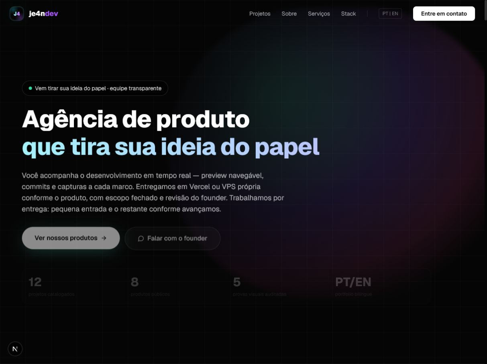
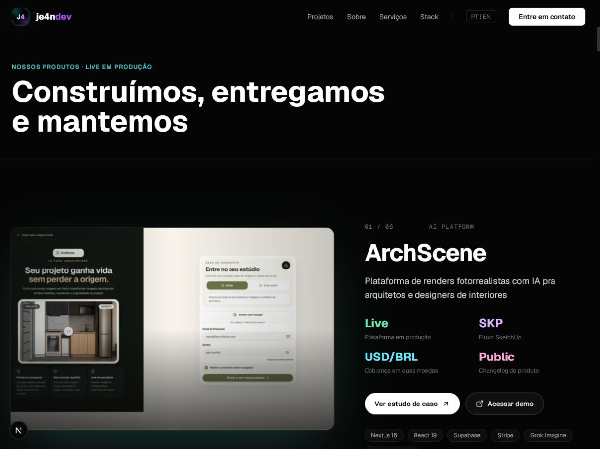
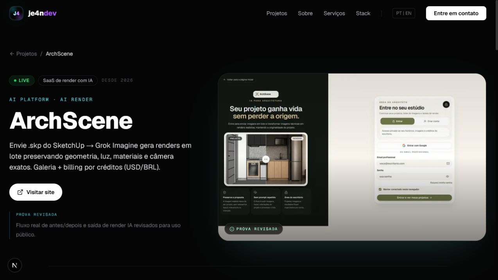
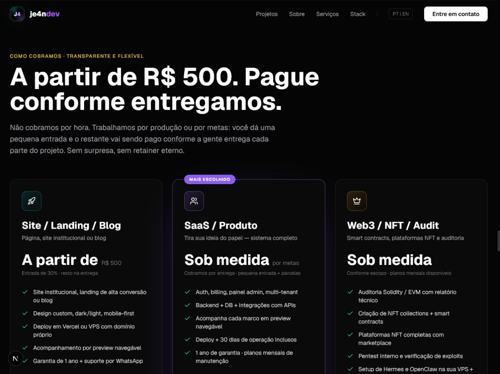
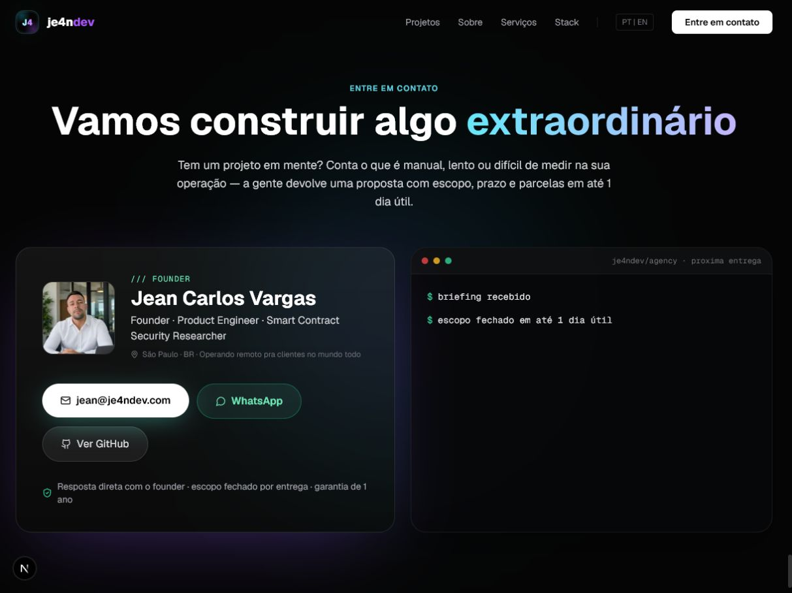
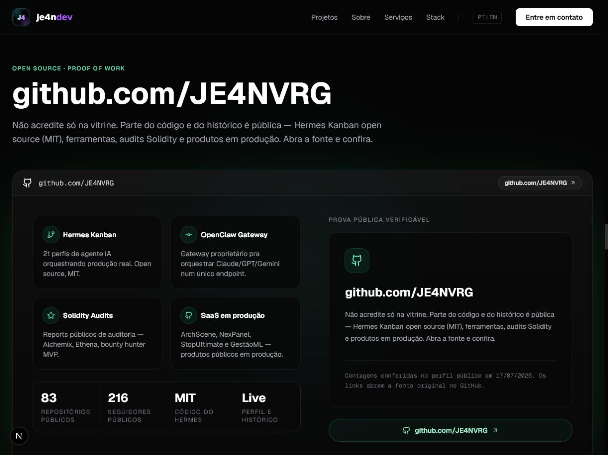

# Auditoria de captação de clientes — 2026-07-17

## Atualização de implementação — 2026-07-18

O corte prioritário desta auditoria foi concluído na branch `feat/project-presentation-system-2026-06`:

- hero reposicionado para sites, sistemas e SaaS, com CTA de prova e CTA de conversa;
- preço público de entrada removido sem inventar um novo valor;
- oferta reescrita para projeto fechado, proposta após briefing e pagamento por marcos;
- promessas fixas de 14/21 dias e proposta em um dia útil substituídas por cronograma definido após validação do escopo;
- FAQ passou a explicar a operação founder-led sem desqualificar freelancers ou agências;
- indicadores do hero atualizados para 12 projetos, 6 produtos públicos e 7 provas visuais revisadas;
- CTAs principais de hero, serviços, oferta, contato, navegação e rodapé instrumentados;
- analytics first-party validado para page view, clique, profundidade de 50/75/90% e 30 segundos de engajamento;
- reflow validado no Navegador em 390 × 844, sem overflow horizontal;
- menu mobile, nomes acessíveis, relações `aria-expanded`/`aria-controls` e alvos críticos de 44 px verificados;
- lint, typecheck, auditor de projetos, `npm audit` e build de produção aprovados.

Não houve deploy. A página revisada permanece apenas no ambiente local até aprovação explícita.

## Escopo

Auditoria combinada de UX, confiança e acessibilidade visível da jornada pública em português:

1. entrada pela home;
2. prova de produtos;
3. estudo de caso;
4. oferta comercial;
5. contato com o founder.

Objetivo do visitante: entender em poucos segundos o que a JE4NDEV entrega, confirmar que existem produtos reais e iniciar uma conversa com segurança.

## Veredito

O portfólio já tem identidade premium, prova de execução e contato direto. A maior barreira para captação não era estética: era confiança comercial. A ordem antiga começava pela oferta mais técnica, a prova do GitHub usava um gráfico sintético parecido com atividade real e um projeto público levava para uma tela sem dados.

As correções seguras foram aplicadas nesta branch. A decisão comercial adotada para este corte foi retirar o preço público de entrada e qualificar cada oportunidade por diagnóstico, escopo e marcos.

## Jornada auditada

### 1. Entrada — saudável com ressalvas

Pontos fortes:

- headline direta e legível;
- CTA de prova e CTA de conversa aparecem acima da dobra;
- transparência de preview, escopo e revisão humana diferencia a oferta.

Riscos:

- o parágrafo principal está longo para leitura de cinco segundos;
- os quatro indicadores no rodapé do hero ficam visualmente muito escuros no estado capturado;
- “agência de produto” ainda exige que o visitante leia o subtítulo para entender sites, SaaS e automações.

### 2. Prova de produtos — forte após reordenação

Pontos fortes:

- estrutura problema, entrega e resultado é adequada para venda consultiva;
- CTA para case e CTA para produto/código dão duas rotas de validação;
- hierarquia e contraste estão consistentes.

Riscos encontrados:

- Hermes aparecia primeiro e exigia vocabulário técnico demais para um cliente PME;
- a arte de Hermes funciona como capa editorial, mas não deve ser tratada como prova de interface real;
- descrições longas em alguns flagships podem atrasar a compreensão.

Correção aplicada: nova ordem prioriza ArchScene, NexPanel, Gestão ML e Vultrix antes de StopUltimate e Hermes.

### 3. Estudo de caso — saudável com lacuna de prova

Pontos fortes:

- CTA ao vivo aparece no primeiro viewport;
- problema, contexto e prova visual estão conectados;
- status e escopo ficam claros antes do texto longo.

Riscos:

- a imagem principal ainda mistura proposta pública e login, não o cockpit autenticado;
- o resultado comercial não apresenta uma métrica de cliente verificável;
- a navegação para um case deve sempre reiniciar no topo; uma captura com posição de scroll preservada mostrou como o primeiro viewport pode cair entre seções em navegação forçada.

Correção aplicada: captura pública atual da ArchScene foi adicionada à galeria como evidência complementar, preservando a regra de não usar landing como prova principal.

### 4. Oferta — visualmente forte, posicionamento pendente

Pontos fortes:

- três ofertas são fáceis de comparar;
- SaaS aparece como recomendação principal;
- forma de pagamento por entrega reduz risco percebido.

Risco estrutural:

- “A partir de R$ 500” pode ancorar toda a agência como serviço barato e atrair leads incompatíveis com projetos de SaaS, integração e operação. O caso Máximo LEDs já mostrou o risco de um site simples evoluir para portal de pedidos sem reprecificação imediata.

Decisão necessária: manter preço de entrada para landing simples, elevar o piso público ou retirar preço da home e qualificar por diagnóstico.

### 5. Contato — saudável

Pontos fortes:

- mostra a pessoa responsável, e-mail, WhatsApp e GitHub;
- explica o primeiro passo e o prazo de resposta;
- o CTA não exige formulário longo.

Riscos:

- o terminal animado não pode ser necessário para entender o processo;
- a promessa de proposta em um dia útil precisa continuar operacionalmente verdadeira;
- não há rota alternativa de briefing estruturado para leads que ainda não querem abrir o WhatsApp.

### 6. Prova pública — saudável após correção

Pontos fortes:

- links abrem o perfil e os repositórios originais;
- contagens exibidas têm data de conferência;
- código aberto, produtos e auditorias aparecem como trilhas de prova distintas.

Correção aplicada: o gráfico sintético parecido com contribuições reais foi removido e a copy deixou de afirmar que todo commit ou todo produto é público.

## Confiança e honestidade

Correções aplicadas:

- removido o gráfico sintético de contribuições do GitHub;
- substituídos números não sustentados por 83 repositórios públicos e 216 seguidores, conferidos no perfil público em 17/07/2026;
- HypeFC foi reclassificado como case/MVP e passou a priorizar o GitHub, pois o endpoint público mostrou “Sem dados” nesta auditoria;
- Alchemix e Ethena receberam capturas atuais com notas que limitam corretamente o que o print comprova;
- Máximo LEDs recebeu captura candidata, mas permanece fora do portfólio até autorização explícita do cliente.

## Acessibilidade visível

Forças confirmadas:

- um H1 único na home e no case;
- links e botões com nomes compreensíveis no DOM;
- imagens principais com texto alternativo;
- contraste forte nos CTAs primários.

Riscos prováveis:

- indicadores do hero apresentam contraste baixo no estado visual capturado;
- textos secundários em cinza escuro podem ficar abaixo do contraste ideal em telas de menor qualidade;
- alguns cards de oferta ficam cortados no primeiro viewport e exigem scroll para alcançar seus CTAs;
- foco visível, ordem de teclado, leitor de tela, zoom a 200% e reflow em 390 px não foram comprovados por screenshots desktop.

## Pendências antes de investir em tráfego

1. Definir o funil de atendimento depois do clique e quem acompanha os eventos registrados no servidor.
2. Adicionar um briefing curto opcional sem remover WhatsApp ou e-mail.
3. Validar navegação completa por teclado, zoom a 200% e leitor de tela em uma auditoria WCAG dedicada.
4. Só publicar depoimentos, logos e o case Máximo LEDs com autorização e origem verificável.
5. Validar comercial e juridicamente garantia, NDA, suporte e termos antes de usá-los em proposta assinada.

## Limites desta auditoria

- capturas iniciais realizadas em desktop 1280 × 800 e revalidação do corte em 390 × 844 no navegador integrado;
- não foi executada auditoria WCAG completa;
- não foram validados dados autenticados dos produtos;
- prints de Alchemix e Ethena comprovam a interface pública observada, não a eficácia independente das análises de segurança;
- o preço e a garantia exigem validação comercial/jurídica fora da revisão visual.
